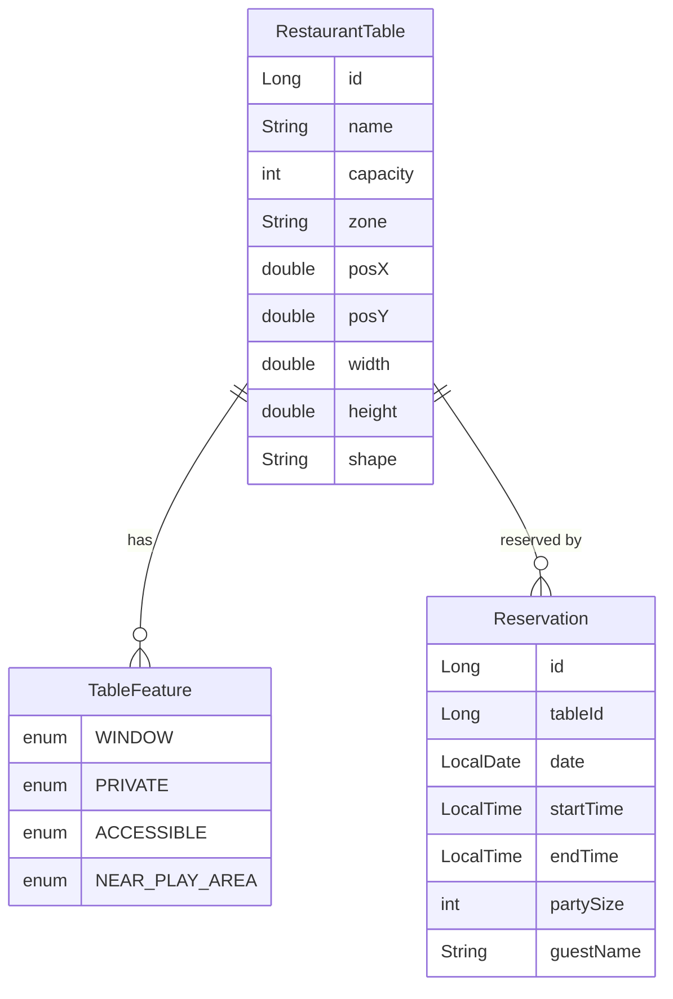

# Architecture

## Domain Model



### Entity Design Decisions

- **`RestaurantTable`** instead of `Table` to avoid collision with `java.util.Table` and SQL reserved word ambiguity.
- **Zone is a string field**, not a separate entity. The restaurant has a fixed set of zones (Window, Main Hall, Private, Terrace) defined in seed data. A full `Zone` entity adds JPA complexity without benefit at this scale.
- **Table position and dimensions** (`posX`, `posY`, `width`, `height`, `shape`) are stored on the entity to drive the SVG floor plan rendering. The frontend reads these to position tables.
- **`TableFeature` is an enum** stored as an element collection. Each table can have multiple features (e.g., a table can be both `WINDOW` and `ACCESSIBLE`).

## Floor Plan Layout

The restaurant has 4 zones with approximately 15-20 tables:

| Zone | Description | Typical features |
|---|---|---|
| Window | Tables along the window wall | `WINDOW`, sometimes `ACCESSIBLE` |
| Main Hall | Central dining area, adjacent to play area | Largest tables; some have `ACCESSIBLE`, `NEAR_PLAY_AREA` |
| Private | Enclosed/semi-enclosed area | `PRIVATE`; lowest table also `NEAR_PLAY_AREA` |
| Terrace | Outdoor/near-outdoor seating | Some tables `NEAR_PLAY_AREA`, some `ACCESSIBLE`, some with no features |

Table capacities range from 2 to 8. Shapes are rectangular or round.

### Architectural Elements

The SVG floor plan includes static architectural features rendered as lines:

- **Walls** (white, width 2) — a vertical wall separates Main Hall from the Private zone; three horizontal walls subdivide the Private area into individual rooms.
- **Window** (light blue `#7EC8E3`, width 3) — runs along the left edge beside the Window zone, representing a glass wall.
- **Entrance** (terracotta `#D4915E`, width 3) — fills the gap between the Window and Terrace zones on the left edge.

## API Contract

### POST `/api/tables/search`

**Request:**
```json
{
  "date": "2026-03-10",
  "startTime": "19:00",
  "partySize": 4,
  "duration": 120,
  "zone": "Window",
  "preferences": ["WINDOW", "ACCESSIBLE"]
}
```

- `zone` is optional. If omitted, all zones are searched.
- `preferences` is optional. If omitted, only capacity efficiency and zone match are scored.
- `duration` is in minutes, defaults to 120 if omitted.

**Response:**
```json
{
  "recommendations": [
    {
      "tableId": 5,
      "tableName": "W3",
      "zone": "Window",
      "capacity": 4,
      "features": ["WINDOW", "ACCESSIBLE"],
      "score": 0.92,
      "scoreBreakdown": {
        "efficiency": 1.0,
        "preferenceMatch": 1.0,
        "zoneMatch": 1.0,
        "base": 0.1
      },
      "posX": 50,
      "posY": 120,
      "width": 60,
      "height": 60,
      "shape": "rectangle"
    }
  ],
  "allTables": [
    {
      "tableId": 1,
      "tableName": "W1",
      "zone": "Window",
      "capacity": 2,
      "status": "available",
      "features": ["WINDOW"]
    }
  ]
}
```

### POST `/api/reservations`

**Request:**
```json
{
  "tableId": 5,
  "date": "2026-03-10",
  "startTime": "19:00",
  "duration": 120,
  "partySize": 4,
  "guestName": "Jane Doe"
}
```

**Response:** `201 Created` with reservation details, or `409 Conflict` if table is already booked for that time.

### POST `/api/reservations/reset`

Clears all reservations and regenerates random ones. No request body. Returns `200 OK`.

### GET `/api/tables`

Returns all tables with their current reservation status for today. Used for initial floor plan rendering.

## Recommendation Scoring Algorithm

```
totalScore = (efficiency × 0.40) + (preferenceMatch × 0.35) + (zoneMatch × 0.15) + (base × 0.10)
```

| Factor | Calculation | Weight |
|---|---|---|
| Efficiency | `1.0 - ((capacity - partySize) / capacity)`, floor at 0.3 | 40% |
| Preference match | `matchedPreferences / requestedPreferences`, or 1.0 if none requested | 35% |
| Zone match | 1.0 if zone matches or no zone requested, 0.5 otherwise | 15% |
| Base | Always 0.1 — ensures every valid table gets a nonzero score | 10% |

Tables with `capacity < partySize` are excluded from results entirely.

## Technology Choice Rationale

| Decision | Chosen | Alternatives considered | Why |
|---|---|---|---|
| Database | H2 in-memory | PostgreSQL, MySQL | Zero setup, sufficient for demo, avoids Docker dependency |
| Frontend | React + TypeScript + Vite | Vue, Angular, plain HTML | Largest ecosystem, strong AI code generation support, fast dev server |
| Floor plan | Raw SVG | Canvas, D3.js, Konva | Simplest, no dependencies, easy to style with CSS, accessible |
| API style | REST | GraphQL | Simpler for 4 endpoints, easier to test, no schema overhead |
| State management | React useState | Redux, Zustand | App has one page and minimal state — a library adds complexity for no gain |
| CSS approach | Plain CSS | Tailwind, styled-components | Fewer build dependencies, sufficient for this scope |
