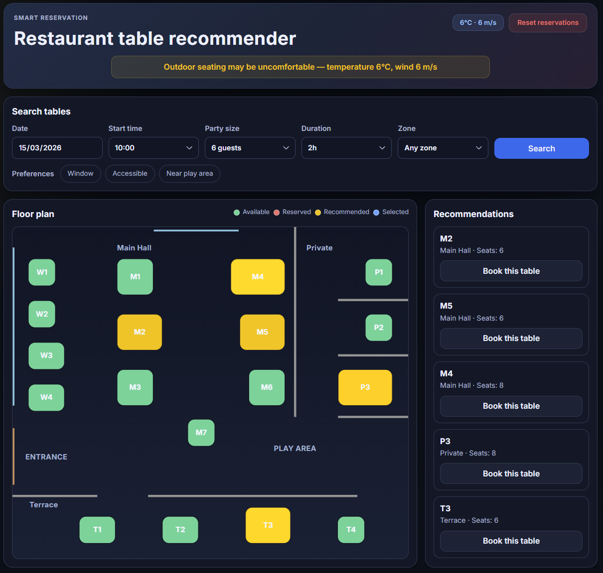
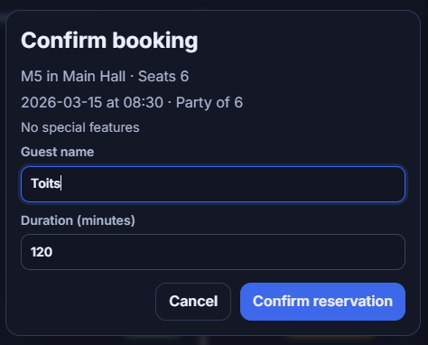
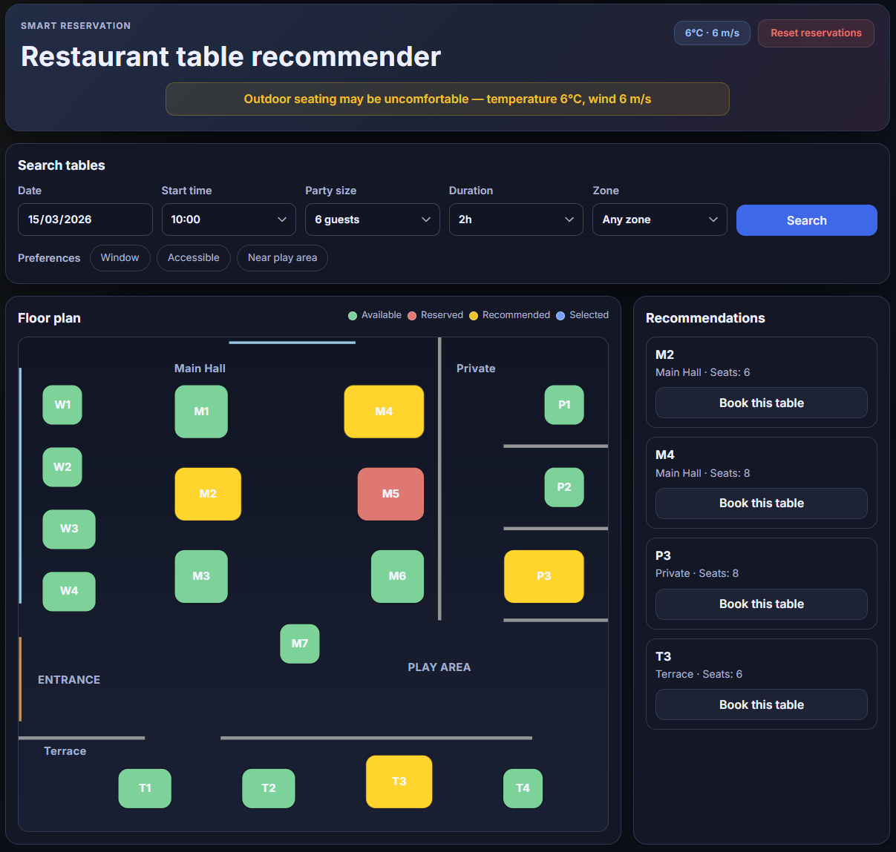
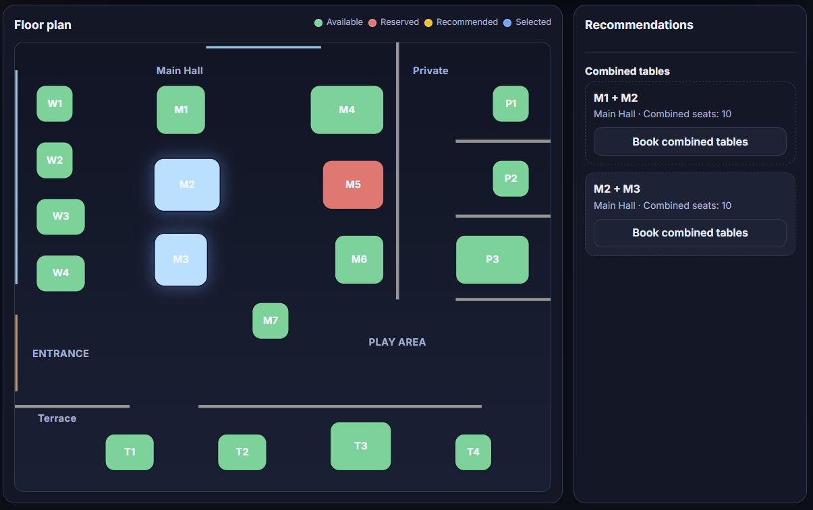
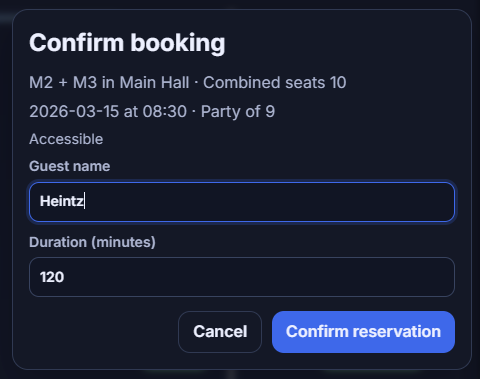
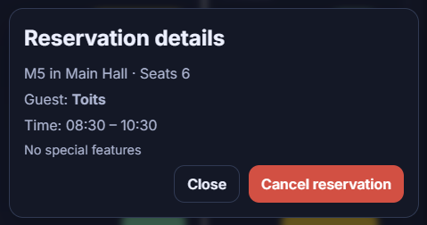
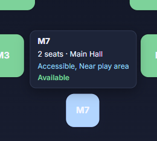
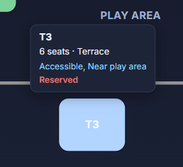

# 🍽️ Smart Restaurant Reservation System

An intelligent table reservation system with an interactive SVG floor plan and transparent recommendation scoring.  
The project was done almost entirely using AI-agent orchestration appraoch. See AI-USAGE.md for details.

## ✨ Features

- **Interactive floor plan** — SVG-based top-down restaurant view with color-coded table status
- **Smart recommendations** — tables ranked by capacity efficiency, preference match, zone fit, and weather conditions
- **Weather-aware scoring** — real-time weather from Open-Meteo penalizes outdoor terrace tables in cold or windy conditions; at ≤5°C terrace tables are excluded entirely
- **Transparent scoring** — see *why* each table is recommended with per-factor score breakdown
- **Preference support** — window seat, privacy, accessibility, children's play area proximity
- **Table combinations** — when no single table fits a large party, the system suggests adjacent table pairs
- **Reservation management** — book tables, view reservation details, cancel bookings
- **Realistic demo data** — randomly generated reservations on each startup, with a reset button

## 📸 Screenshots

### Full UI — Search, Floor Plan, Recommendations & Weather



*Search form with preferences, color-coded floor plan (green = available, yellow = recommended, red = reserved), ranked recommendations, weather warning for terrace tables, and table tooltip.*

### Booking Flow

| Booking Dialog | Successful Booking |
|---|---|
|  |  |

### Table Combinations

| Combined Recommendation | Combination Booking |
|---|---|
|  |  |

### Reservation Details & Tooltips

| Reserved Table Details | Available Table Tooltip | Reserved Table Tooltip |
|---|---|---|
|  |  |  |

## 🚀 Quick Start

### Prerequisites

- Java 25+
- Node.js 18+

### Backend

```bash
cd backend
./mvnw spring-boot:run
```

The API starts at `http://localhost:8080`.

### Frontend

```bash
cd frontend
npm install
npm run dev
```

Open `http://localhost:5173` in your browser.

## 🏗️ Architecture

| Layer | Technology | Rationale |
|---|---|---|
| Backend | Spring Boot 3.x + Java 25 | Assignment requirement (latest LTS) |
| Database | H2 (in-memory) | Zero configuration, ideal for demo |
| Frontend | React 19 + TypeScript | Strong ecosystem, type safety, fast dev with Vite |
| Floor plan | SVG (no libraries) | Simple, stylable, accessible, no external dependencies |
| Build | Maven | Convention in Spring Boot ecosystem |

### How the Recommendation Engine Works

When a user searches for a table, the system:

1. Filters out tables that are reserved during the requested time window
2. Filters by minimum capacity for the party size
3. Filters by zone if one is requested
4. Scores each remaining table on five factors:
   - **Capacity efficiency (35%)** — prefers tables whose size closely matches the party (avoids seating 2 people at an 8-top)
   - **Preference match (30%)** — fraction of requested preferences the table supports
   - **Zone match (10%)** — bonus if the table is in the preferred zone
   - **Weather penalty (20%)** — penalizes Terrace tables in cold or windy weather; the harsher of the two sub-penalties applies. At the maximum penalty (-1.0) terrace tables are excluded entirely.

     | Temperature | Penalty |
     |---|---|
     | ≥ 15 °C | 0.0 (none) |
     | 5–15 °C | linear (e.g. 10 °C → -0.5) |
     | ≤ 5 °C | -1.0 (excluded) |

     | Wind speed | Penalty |
     |---|---|
     | ≤ 5.6 m/s | 0.0 (none) |
     | 5.6–11.1 m/s | linear (e.g. 8.3 m/s → -0.5) |
     | ≥ 11.1 m/s | -1.0 (excluded) |
   - **Base score (5%)** — ensures all valid tables get a minimum score
5. Returns the top-ranked tables with a per-factor score breakdown

See [ARCHITECTURE.md](ARCHITECTURE.md) for detailed design documentation.

## 📐 API Endpoints

| Method | Endpoint | Description |
|---|---|---|
| `POST` | `/api/tables/search` | Search available tables with ranked recommendations |
| `GET` | `/api/tables` | All tables with current status and reservation info |
| `POST` | `/api/reservations` | Book a table (with overlap validation) |
| `DELETE` | `/api/reservations/{id}` | Cancel a reservation |
| `POST` | `/api/reservations/reset` | Regenerate random reservations |
| `GET` | `/api/weather` | Current weather (Open-Meteo, cached 10 min) |

## 🐳 Docker

```bash
docker-compose up
```

Opens at `http://localhost:3000`. Backend API at `http://localhost:8080`.

Requires Docker and Docker Compose. No Java or Node.js installation needed.

## 🧪 Testing

```bash
cd backend
./mvnw test
```

31 tests: 16 unit tests (recommendation scoring, combinations, weather penalties), 10 integration tests (MockMvc controllers), 4 weather service tests, 1 context load test. See [TESTS.md](TESTS.md) for full inventory.

## ⏱️ Time Spent

The project took one week to complete. I started on 8th of March and finished on 15th. There was one day I worked full day. All other days I worked for about half a day.

## 📋 Documentation

- [ARCHITECTURE.md](ARCHITECTURE.md) — domain model, scoring algorithm, API contract, design decisions
- [ASSUMPTIONS.md](ASSUMPTIONS.md) — documented assumptions with reasoning
- [AI-USAGE.md](AI-USAGE.md) — AI tools used, methodology, and detailed change log
- [PROBLEMS.md](PROBLEMS.md) — issues encountered with root causes and solutions
- [TESTS.md](TESTS.md) — test inventory with descriptions and run commands
- [PROGRESS.md](PROGRESS.md) — phase tracker with task checklists

## 📝 License

Built as a technical assessment submission.
